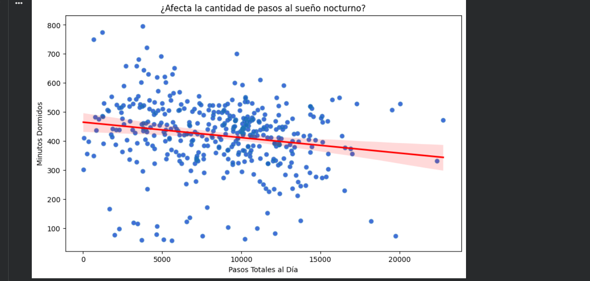
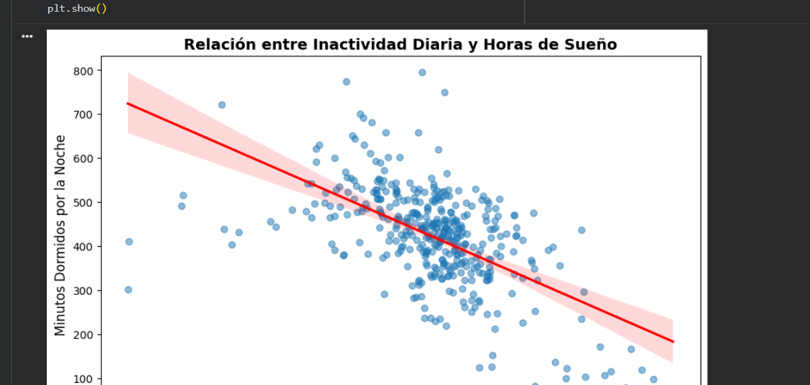

# 📊 Caso de Estudio: BellaBeat

**Optimización de Estrategias de Marketing basadas en Datos de Usuarios**

Proyecto final del *Google Data Analytics Professional Certificate*. Analiza el comportamiento de usuarios de wearables (dataset público FitBit) para identificar oportunidades de marketing para BellaBeat, una empresa de tecnología wearable enfocada en la salud de la mujer.

---

## 🎯 Objetivo

Identificar tendencias clave en el uso diario de dispositivos inteligentes y traducirlas en recomendaciones de marketing accionables para el equipo ejecutivo de BellaBeat.

## 🛠️ Stack técnico

- **SQL / Google BigQuery** — limpieza y consolidación de datos
- **Python (Pandas, Seaborn, Matplotlib)** — análisis estadístico y visualización
- **Dataset:** [FitBit Fitness Tracker Data](https://www.kaggle.com/datasets/arashnic/fitbit) (Kaggle)

## 🔎 Proceso

Se siguió el ciclo completo de análisis de datos: **Ask → Prepare → Process → Analyze → Share → Act**.

1. **Prepare/Process:** limpieza y consolidación de 2 tablas (actividad diaria + sueño) en BigQuery mediante `INNER JOIN`, resultando en una tabla maestra de 413 registros sin valores nulos. Ver [`sql/consolidacion_tabla_maestra.sql`](sql/consolidacion_tabla_maestra.sql).
2. **Analyze:** estadística descriptiva y análisis de correlación en Python. Ver [`python/analisis_bellabeat.py`](python/analisis_bellabeat.py).
3. **Share/Act:** traducción de hallazgos en recomendaciones de producto/marketing. Ver el informe completo en [`reports/caso_estudio_bellabeat_reporte.pdf`](reports/caso_estudio_bellabeat_reporte.pdf).

## 📈 Hallazgos principales

| Métrica | Valor promedio diario |
|---|---|
| Pasos totales | 8,541 (por debajo de la meta OMS de 10,000) |
| Tiempo sedentario | ~11.9 horas |
| Tiempo dormido | ~7.0 horas |

**Correlaciones (Pearson):**
- Pasos totales ↔ Sueño: **r = -0.19** (débil, no significativa)
- Sedentarismo ↔ Sueño: **r = -0.60** (negativa y fuerte — el driver real del descanso)

## 💡 Recomendación estratégica

El verdadero punto de dolor no es la falta de pasos, sino el **alto volumen de sedentarismo diario**. Se propone una función de notificaciones predictivas ("Alertas de Movimiento Inteligente") que detecta bloques prolongados de inactividad y motiva a la usuaria a moverse, vinculando la interrupción del sedentarismo con el beneficio directo del sueño.

Detalle completo de las 3 recomendaciones en el [informe PDF](reports/caso_estudio_bellabeat_reporte.pdf).

## 📝 Nota metodológica

Una versión preliminar de este análisis contenía un error de mapeo de columnas en la consulta SQL (la columna de sueño se vinculó por error a `TotalDistance` en lugar de `TotalMinutesAsleep`). El error fue detectado en control de calidad, corregido, y el pipeline completo (SQL → Python) fue revalidado. Los resultados de este repositorio reflejan la versión corregida.

## 🎓 Certificación

Este proyecto fue desarrollado como proyecto final del **Google Data Analytics Professional Certificate** (Google / Coursera).

📄 Certificado: [`certificates/google_data_analytics_certificate.png`](certificates/google_data_analytics_certificate.png)
🔗 Verificación pública: *(agregar acá el link de Credly)*

---

## 📬 Contacto

**Matías Batalla** — Economista & Analista de Datos
[LinkedIn](https://www.linkedin.com/in/matiasbatalla27) · [Portfolio](https://matiasbatalla.github.io/portafolio-matias/)
